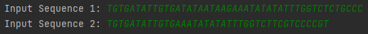
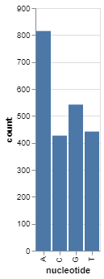
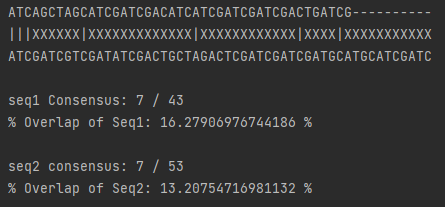

# Alignment Match Code
A series of simple bioinformatic modules put together for working with genetic information.

This was written for practice and for my own ease of alignment and manipulation of nucleic acid sequences.

# Conversion between DNA and RNA
Application of Regex to replace thymine/uracil nucleotides.

Can be similarly performed for conversion of RNA to DNA

# Obtaining the Reverse Complement of a DNA Sequence

Input a DNA sequence to obtain its reverse complement presented from its 5' to 3' end

# Obtaining Nucleotide Content of a DNA Sequence

A module to obtain the nucleotide count and GC content of input DNA sequences.

Example of the nucleotide contents of the TOP1 gene coding sequence

# DNA Sequence Alignment

For sequence alignment of 2 sequences, the count of each sequence will be returned alongside the number of matching base pairs

