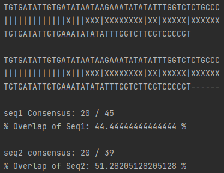

# Alignment Match Code
This was written for practice and for my own ease of alignment and manipulation of nucleic acid sequences to facilitate primer design.

#Conversion between DNA and RNA
Application of Regex to replace thymine/uracil nucleotides.

Can be similarly performed for conversion of RNA to DNA

#Alignment of base pairs

For sequence alignment, the count of each sequence will be returned alongside the number of matching base pairs

